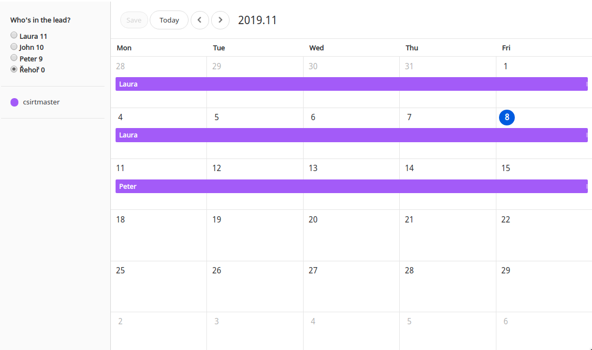

# Schedule-shift

Simple work scheduling for a small team. If you have several projects that need now and then and are searching for a tool to keen an eye if one of you took the shift, read further. You write down teammates, assign them to project in an `.ini` file and let them choose their shift via a [tui-calendar](https://ui.toast.com/tui-calendar/) through a web service. Their selected dates are saved to a CalDAV calendar. Set-up a cron according to your needs, ex: to send the shift information at the shift beginning/every day to everybody/shift owner or only if nobody is assigned.

# API

* Access "/" for GUI (HTML)
* Access "/who" for current shift (JSON)

# Sending mail syntax

Let your mail be generated by calling:
```bash
$./scheduler.py [project_name] [shift state] [whom to write] [fallback e-mail], ...
```
Note that if `--send` flag is not present, no e-mails are sent.

* project name: 'all' (default) to match all of the defined project.
* shift state
    * any - (default) Any state, doesn't matter whether it's starting, ending or if nobody has it.
    * starting - When this is the first day of a new shift.
    * proceeding - When we are in the middle of a shift.
    * ending - When this is the last day of a shift.
    * none - Send the notification only when nobody's got the shift planned.
* whom to write:
    * owner - (default) Send the notification to the shift owner only if set or to all members if nobody's got the shift.
    * all - All members of a project.
    * e-mail - Use this custom e-mail to notify.
* fallback e-mail
    * Can be set to an e-mail that gets notified when nobody's got their shift planned.
    * If not set, we notify the e-mail specified in 'who' parameter or all project members (if 'who' is set to 'owner' or 'all').
    * If set to 'mute', nobody'll be notified.

## Examples
Send the notification
     to all members of project `my_project`:

```bash
./scheduler.py notify my_project any all
```
To all members of project `my_project` and of `another_project` when anybody shift's ending:

```bash
./scheduler.py notify my_project ending all, another_project ending all
```

To the shift owner if the shift is starting but don't send info if no shift is taken
```bash
./scheduler.py notify my_project starting owner mute
```
To an e-mail when this is the last day of a shift on any project
```bash
./scheduler.py notify all ending example@example.com
```

# Screenshot



# Deployment

* Download the source code:
```
git clone git@github.com:CZ-NIC/schedule-shift.git
```
* Create `scheduler.yaml` from [`scheduler.yaml.default` file](scheduler.yaml.default), specify your teammates and assign them to the projects.
* Systemd configuration: Move `misc/schedule-shift.service` to `/etc/systemd/system/schedule-shift.service`
* Nginx configuration file:

```nginx
server {
    listen 7000;
    server_name example.com;

    location / {
        include uwsgi_params;
        uwsgi_pass unix:/tmp/schedule-shift.sock;
    }
}
```
* Start and check service status
```bash
service schedule-shift start
service schedule-shift status
```
* If that's all right, let's make the service permanent:
```bash
systemctl enable schedule-shift
```
* Put a cron so that your users will receive e-mails:
```cron
30 5 * * 1-5 cd /opt/schedule-shift && python3 scheduler.py notify all starting --send
0 6 * * Tue expr `date +\%W` \% 2 > /dev/null || python3 /opt/schedule-shift/scheduler.py notify all starting --send # notify every second Tuesday
```


